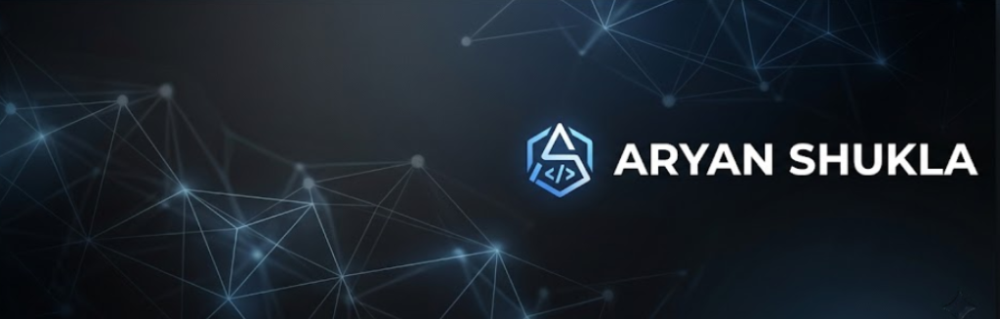

<div align="center">



[](https://git.io/typing-svg)

<br/>

[](https://linkedin.com/in/aryanshukla4132)
[](mailto:aryanshukla4132@gmail.com)
[](https://github.com/Aryan4132)
[](https://github.com/Aryan4132)

</div>

<br/>

## 🧑‍💻 About Me

> *I build tools that make AI work for you — offline, fast, and on your own terms.*

Computer Engineering student at **Don Bosco Institute of Technology, Mumbai** *(graduating May 2028)*, specialising in autonomous agents, local-first AI systems, and high-performance full-stack applications. My obsession: pushing LLMs out of the cloud and into the OS.

```yaml
name:       Aryan Shukla
location:   Mumbai, Maharashtra 🇮🇳
education:  B.E. Computer Engineering @ DBIT (2024 – 2028)
focus:      Local-First AI · Agentic Systems · Knowledge Graphs · Systems Programming
building:   Meridian-X — an offline autonomous desktop AI agent
exploring:  GraphRAG · 3D Semantic Visualisation · Rust · P2P Networking
```

<br/>

## ⚡ Tech Arsenal

<div align="center">

**Languages**

[](https://skillicons.dev)

**Frontend & Desktop**

[](https://skillicons.dev)

**Backend & Databases**

[](https://skillicons.dev)

**Tools & Platforms**

[](https://skillicons.dev)

<br/>

**AI / ML Specialisation**


</div>

<br/>

## 🏆 GitHub Trophies

<div align="center">

[](https://github.com/ryo-ma/github-profile-trophy)

</div>

<br/>

## 🚀 Flagship Projects


### 🧠 [Meridian-X](https://github.com/Aryan4132/Meridian-X) &nbsp;—&nbsp; Autonomous Offline Desktop Agent

<table>
<tr>
<td>

**Stack:** `Tauri` `React 19` `FastAPI` `Ollama` `SQLite` `Python`

A local-first AI workspace companion that runs **100% offline** — automating OS-level tasks, parsing your documents, and reasoning through complex multi-step workflows, all without a single cloud call.

| Metric | Result |
|--------|--------|
| Query latency vs cloud | **↓ 40%** via local Ollama inference |
| Tool-call success rate | **92%** with ReAct + JSON validation |
| RAG response time | **< 200 ms** on local SQLite vector extension |
| Architecture | Speculative Concurrency Filter — parallel reads, queued writes |

</td>
</tr>
</table>

<br/>

### 📈 [InvestIQ](https://github.com/Aryan4132/InvestIQ) &nbsp;—&nbsp; AI Wealth Terminal

<table>
<tr>
<td>

**Stack:** `React 19` `Express.js` `MongoDB` `Ollama` `Recharts` `Zustand`

Real-time financial analytics platform with live stock pricing, AI-powered portfolio advisory, and a streaming inference chatbot built for speed.

| Metric | Result |
|--------|--------|
| Time-to-First-Token | **↓ 65%** via SSE streamed AI responses |
| External API calls | **↓ 80%** with 4-hour MongoDB price caching |
| UX | Zustand store with optimistic transaction updates |

</td>
</tr>
</table>

<br/>

### 🕸️ [Local 3D Knowledge Graph](https://github.com/Aryan4132/knowledge-graph) &nbsp;—&nbsp; Semantic Visualiser

<table>
<tr>
<td>

**Stack:** `Three.js` `React` `FastAPI` `MongoDB` `Ollama` `GraphRAG`

Transforms a folder of fragmented documents into a living, traversable **3D knowledge graph** — with autonomous semantic linking and GraphRAG-enhanced local LLM context.

| Metric | Result |
|--------|--------|
| Semantic nodes auto-generated | **50+** per folder via local text embeddings |
| Documents traversable in real-time | **500+** in 3D force-directed graph |
| LLM prompt relevance boost | **+35%** via adjacent GraphRAG node context |
| File-system watcher | Real-time vector DB updates — **0% UI freeze** |

</td>
</tr>
</table>

<br/>

### 🛠️ [JavaMini](https://github.com/Aryan4132/javamini) &nbsp;—&nbsp; Compiler Experiment

<table>
<tr>
<td>

**Stack:** `JavaScript` `Node.js`

A lightweight interpreter translating subsets of JavaScript & Java into intermediate execution models — custom **lexer → parser → AST evaluator** pipeline, built from scratch to understand compiler internals end-to-end.

</td>
</tr>
</table>


<br/>

## 📊 Contribution Activity

<div align="center">

[](https://github.com/ashutosh00710/github-readme-activity-graph)

</div>

<br/>

<!-- Snake animation — requires a GitHub Action in your profile repo.
     Add this workflow: https://github.com/Platane/snk
     It generates: output/github-contribution-grid-snake-dark.svg -->
<div align="center">


</div>

<br/>

## 📫 Let's Connect

<div align="center">

[](https://linkedin.com/in/aryanshukla4132)
[](mailto:aryanshukla4132@gmail.com)

</div>

<br/>

<div align="center">


</div>
